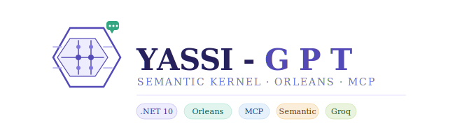

# 🤖 MyCustomGPT

> A production-ready, multi-agent AI chat system built with .NET C#, Microsoft Orleans, and MCP — your own scalable ChatGPT alternative using free API tiers.

[](https://dotnet.microsoft.com)
[](https://learn.microsoft.com/dotnet/orleans)
[](https://github.com/modelcontextprotocol/csharp-sdk)
[](LICENSE)

---

<p align="center">
  
</p>

## ✨ Features

- **Multi-Agent Architecture** — Route messages to specialized agents (coder, analyst, general)
- **Microsoft Orleans** — Scalable, distributed actor model with per-user grain state
- **Persistent Chat History** — Each user's conversation stored in Orleans grain storage
- **MCP Tool Integration** — Plug-and-play tools: web search, datetime, code execution
- **Free LLM Providers** — Google Gemini Flash (free tier) + Groq/Llama3 fallback
- **Agentic Loop** — LLM autonomously calls tools until it has a final answer
- **REST API** — Clean ASP.NET Core endpoints for chat, history, and agent selection

---

## 🏗️ Architecture

```
User Request
     │
     ▼
ASP.NET Core API  (/api/chat/{userId})
     │
     ▼
Orleans Silo (in-process)
 ├── ChatGrain          ← per-user state & history (IGrainWithStringKey)
 └── AgentOrchestratorGrain
      ├── GeneralAgentGrain
      ├── CoderAgentGrain
      └── AnalystAgentGrain
           │
           ▼
      MCP Client Layer
       ├── web_search  (Tavily API — free)
       ├── get_datetime
       └── code_runner
           │
           ▼
      LLM Provider
       ├── Google Gemini 1.5 Flash  (primary — free tier)
       └── Groq / Llama3-70B        (fallback — free tier)
```

<p align="center">
  
</p>

---

## 📁 Project Structure

```
MyCustomGPT/
├── MyCustomGPT.sln
├── MyCustomGPT.Api/              # ASP.NET Core host + Orleans silo
│   ├── Controllers/
│   │   └── ChatController.cs
│   ├── Program.cs
│   └── appsettings.json
├── MyCustomGPT.GrainInterfaces/  # Shared contracts
│   ├── IChatGrain.cs
│   ├── IAgentGrain.cs
│   └── Models/ChatMessage.cs
├── MyCustomGPT.Grains/           # Grain implementations
│   ├── ChatGrain.cs
│   └── AgentGrain.cs
├── MyCustomGPT.McpTools/         # MCP stdio tool server
│   ├── Tools/WebSearchTool.cs
│   ├── Tools/DateTimeTool.cs
│   └── Program.cs
└── MyCustomGPT.Agents/           # Agent helpers
    └── McpClientFactory.cs
```

<p align="center">
  
</p>

---

## 🚀 Quick Start

### Prerequisites

- [.NET 10 SDK](https://dotnet.microsoft.com/download)
- Free API keys (see below)

### 1. Clone the repo

```bash
git clone https://github.com/YOUR_USERNAME/mycustomgpt.git
cd mycustomgpt
```

### 2. Set API keys

```bash
cd MyCustomGPT.Api
dotnet user-secrets set "Gemini:ApiKey" "your_key_here"
dotnet user-secrets set "Tavily:ApiKey" "your_key_here"
```

Or edit `appsettings.Development.json`:

```json
{
  "Gemini":  { "ApiKey": "YOUR_GEMINI_KEY" },
  "Groq":    { "ApiKey": "YOUR_GROQ_KEY"   },
  "Tavily":  { "ApiKey": "YOUR_TAVILY_KEY" }
}
```

### 3. Run

```bash
dotnet run --project MyCustomGPT.Api
```

The API starts at `https://localhost:5001`.

---

## 🔑 Free API Keys

| Provider | Model | Free Tier | Get Key |
|---|---|---|---|
| **Google Gemini** | gemini-1.5-flash | 1M tokens/min | [aistudio.google.com](https://aistudio.google.com/app/apikey) |
| **Groq** | llama3-70b-8192 | 14,400 req/day | [console.groq.com](https://console.groq.com/keys) |
| **Tavily** | Web Search | 1,000 req/month | [tavily.com](https://tavily.com) |

---

## 📡 API Reference

### Send a message

```http
POST /api/chat/{userId}
Content-Type: application/json

{
  "message": "Explain async/await in C#",
  "agentType": "coder"
}
```

**Agent types:** `general` (default) · `coder` · `analyst`

**Response:**
```json
{ "response": "Async/await in C# is..." }
```

### Get chat history

```http
GET /api/chat/{userId}/history
```

### Clear history

```http
DELETE /api/chat/{userId}/history
```

---

## 🛠️ Adding a New MCP Tool

1. Create a class in `MyCustomGPT.McpTools/Tools/`:

```csharp
[McpServerToolType]
public class MyTool
{
    [McpServerTool(Name = "my_tool", Description = "What this tool does")]
    public async Task<string> RunAsync(
        [Description("Input description")] string input)
    {
        // your implementation
        return result;
    }
}
```

2. Register in `MyCustomGPT.McpTools/Program.cs`:

```csharp
builder.Services.AddMcpServer()
    .WithTools<WebSearchTool>()
    .WithTools<MyTool>();  // ← add this
```

---

## 🌱 Adding a New Agent

1. Add to `IAgentGrain.cs` or create a specialized interface
2. Implement in `MyCustomGPT.Grains/Agents/`
3. Register in the system prompt router in `AgentGrain.cs`:

```csharp
private string GetSystemPrompt(string agentType) => agentType switch
{
    "coder"    => "You are an expert software engineer...",
    "analyst"  => "You are a data analyst...",
    "my_agent" => "You are a ...",   // ← add this
    _          => "You are a helpful AI assistant..."
};
```

---

## 🔧 Configuration

| Key | Description | Default |
|---|---|---|
| `Gemini:ApiKey` | Google AI Studio key | _(required)_ |
| `Groq:ApiKey` | Groq API key | _(optional fallback)_ |
| `Tavily:ApiKey` | Tavily search key | _(required for web search)_ |
| `Orleans:ClusterStorage` | `Memory` / `Redis` / `AzureTable` | `Memory` |
| `Orleans:MaxHistoryMessages` | Messages kept per user | `50` |

---

## 🤝 Contributing

Pull requests welcome. For major changes, please open an issue first.

1. Fork the repo
2. Create a feature branch: `git checkout -b feature/my-feature`
3. Commit changes: `git commit -m 'Add my feature'`
4. Push: `git push origin feature/my-feature`
5. Open a Pull Request

---

## 📄 License

[MIT](LICENSE) — free to use, modify, and distribute.

---

*Built with ❤️ using .NET 10, Orleans 9, MCP C# SDK, and free LLM APIs.*
